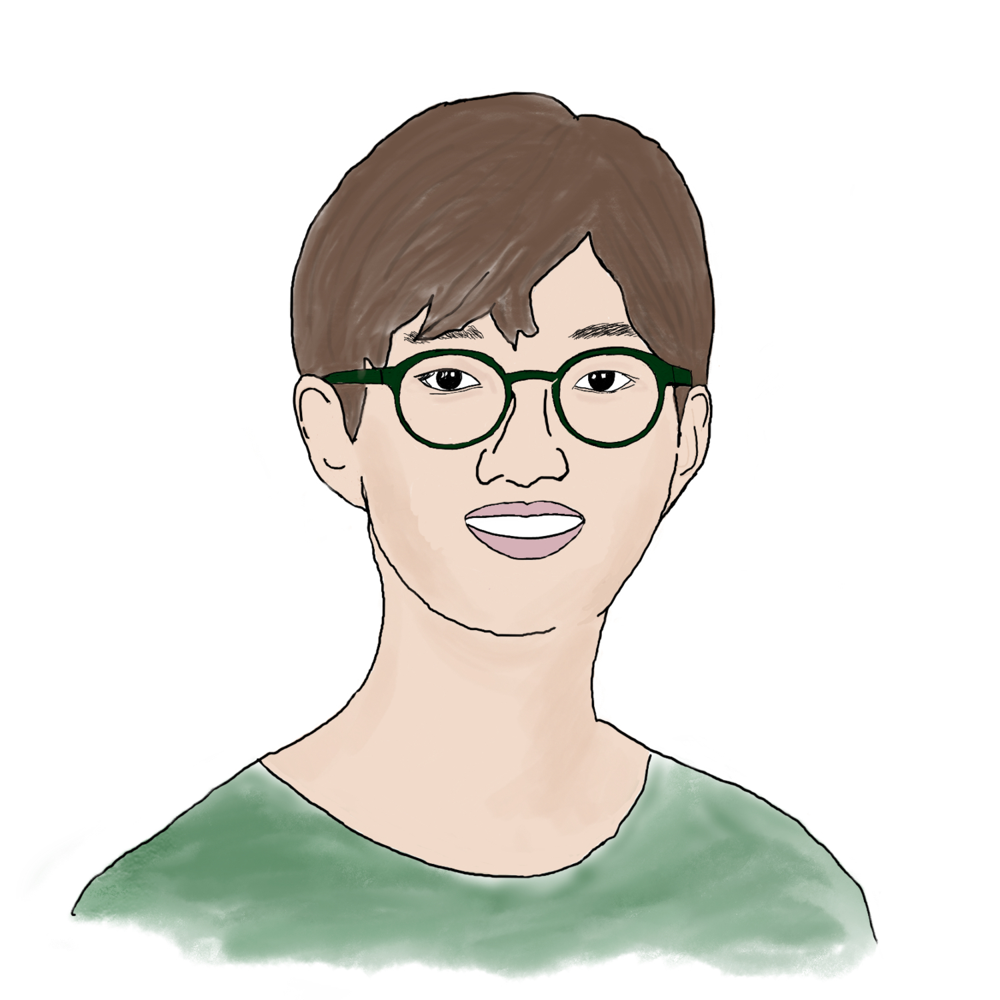

# About Me

Hello, my name is Sangwook Cheon.

I am a high school student at Jakarta Intercultural School, passionate about Data Science, computers, and undiscovered gems hidden in the sea of information. I mainly program in Python and use statistics, data analysis, machine learning and other tools to work with data.

## Personal Projects

## Links
* [GitHub](https://github.com/SangwookCheon)
* [Kaggle](https://www.kaggle.com/sangwookchn)
* [Medium](https://medium.com/@sangwookcheon)
* [LinkedIn](https://www.linkedin.com/in/sangwookcheon/)
